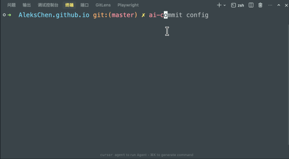

# AI Commit

**[English](README.md) | [简体中文](README_zh.md) | [日本語](README_ja.md) | [한국어](README_ko.md) | [Español](README_es.md) | [العربية](README_ar.md)**


أداة CLI قوية تقوم بإنشاء رسائل **Conventional Commits** من تغييرات git الخاصة بك باستخدام واجهات برمجة تطبيقات متوافقة مع OpenAI. توقف عن المعاناة مع رسائل الالتزام (commit messages). دع الذكاء الاصطناعي يكتبها لك — موجزة، موحدة، وذات مغزى. **🔒 آمن تمامًا | 🛡️ الخصوصية أولاً | 🆓 100% مجاني ومفتوح المصدر**


## المميزات

- 🔒 **الخصوصية أولاً**: يتم إرسال الكود الخاص بك مباشرة إلى مزود API الذي قمت بتكوينه. لا توجد خوادم وسيطة، ولا تتبع. **مفتوح المصدر بنسبة 100%** — قم بتدقيقه بنفسك. يتم تخزين التكوين محليًا، مما يضمن أمانًا مطلقًا بدون أبواب خلفية.
- 🤖 **توليد مدعوم بالذكاء الاصطناعي**: يحلل `git diff` الخاص بك لتوليد رسائل التزام دقيقة ووصفية.
- 📏 **Conventional Commits**: يتبع التنسيق القياسي (feat, fix, chore, إلخ) مباشرة.
- 🎯 **خيارات متعددة**: يولد أشكالًا متعددة لرسائل الالتزام لتختار من بينها.
- 🌍 **دعم متعدد اللغات**: مترجم بالكامل إلى **الإنجليزية**، **الصينية**، **اليابانية**، **الكورية**، **الإسبانية**، و **العربية**.
- 🔧 **قابل للتكوين للغاية**: دعم لواجهات API المخصصة المتوافقة مع OpenAI (مثل DeepSeek, Azure)، والنماذج المخصصة، والمطالبات (prompts).
- 📊 **تتبع التكلفة**: إحصائيات استخدام مدمجة لتتبع استهلاك الرموز (tokens) والتكاليف.
- 🚀 **الوضع التفاعلي**: مراجعة، تحرير، إعادة إنشاء، أو الالتزام مباشرة من واجهة سطر الأوامر (CLI).
- 🧠 **سياق ذكي**: يضغط تلقائيًا الفروق (diffs) الكبيرة لتناسب حدود الرموز مع الحفاظ على السياق.
- 🎨 **فنون ASCII ممتعة**: لافتة بدء قابلة للتخصيص (Psyduck, Totoro, Cat, إلخ).
- 🪝 **دعم Git Hook**: يمكن استخدامه كخطاف `prepare-commit-msg` أو مع أدوات git أخرى.

## التثبيت

تأكد من تثبيت Node.js (>= 18.0.0).

```bash
# التثبيت عالميًا عبر npm
npm install -g @alekschen/ai-commit
```

## التحديث

تتحقق هذه الأداة تلقائيًا من التحديثات وستخطرك إذا كان هناك إصدار جديد متاح. للتحديث يدويًا:

```bash
npm install -g @alekschen/ai-commit@latest
```

## البداية السريعة

1.  **تهيئة الإعدادات**
    قم بتشغيل أمر التكوين لإعداد مفتاح API الخاص بك (OpenAI أو مزود متوافق).

    ```bash
    ai-commit config
    ```

    

2.  **إنشاء التزام (Commit)**
    قم بتجهيز تغييراتك وتشغيل:

    ```bash
    git add .
    ai-commit
    ```

    أو ببساطة قم بتشغيل `ai-commit` ودعه يجهز التغييرات لك.

    

3.  **مراجعة والتزام**
    ستقوم الأداة بإنشاء رسالة. يمكنك:
    - **اختيار**: اختر الرسالة المفضلة لديك.
    - **تحرير**: تعديل الرسالة في محررك الافتراضي.
    - **إعادة إنشاء**: الطلب من الذكاء الاصطناعي المحاولة مرة أخرى.

## الاستخدام

### الأوامر الأساسية

```bash
# إنشاء رسالة التزام للتغييرات المجهزة
ai-commit

# تقديم تلميح لتوجيه التوليد
ai-commit "إعادة هيكلة منطق المصادقة"

# طباعة الرسالة إلى stdout بدون قائمة تفاعلية (مفيد للنصوص البرمجية)
ai-commit --print

# كتابة الرسالة إلى ملف (مفيد لخطافات git مثل prepare-commit-msg)
ai-commit --write .git/COMMIT_EDITMSG

# التشغيل في الوضع الهادئ (إخفاء الشعارات/السجلات)
ai-commit --quiet
```

### الإعدادات

أدر إعداداتك عبر القائمة التفاعلية:

```bash
ai-commit config
```

يمكنك تكوين:

- **مزود API**: عنوان URL الأساسي (الافتراضي: `https://api.openai.com/v1`) ومفتاح API.
- **النموذج**: اختر أي نموذج دردشة (الافتراضي: `gpt-3.5-turbo`).
- **نمط المطالبة (Prompt)**: اختر من بين القوالب الافتراضية، الإيموجي، البسيطة، أو المخصصة.
- **فن ASCII**: تخصيص شعار البدء.
- **اللغة**: تبديل لغة واجهة المستخدم (الإنجليزية، الصينية، اليابانية، الكورية، الإسبانية، العربية).

### عرض إحصائيات الاستخدام

تحقق من استخدام API الخاص بك، وعدد الرموز، وأداء النموذج:

```bash
ai-commit cost
```

## متغيرات البيئة

يمكنك تجاوز التكوين باستخدام متغيرات البيئة، وهو مفيد لخطوط أنابيب CI/CD:

| المتغير                      | الوصف                                                             |
| ---------------------------- | ----------------------------------------------------------------- |
| `AI_COMMIT_API_KEY`          | مفتاح API الخاص بك                                                |
| `AI_COMMIT_BASE_URL`         | عنوان URL الأساسي المخصص لـ API                                   |
| `AI_COMMIT_MODEL`            | اسم النموذج (مثال: `gpt-4`, `deepseek-chat`)                      |
| `AI_COMMIT_MAX_CHARS`        | الحد الأقصى للأحرف لسياق الفرق (الافتراضي: 200000)                |
| `AI_COMMIT_MAX_FILES`        | الحد الأقصى للملفات للمعالجة (الافتراضي: 50)                      |
| `AI_COMMIT_MAX_LINES`        | الحد الأقصى للأسطر لكل ملف لتضمينها (الافتراضي: 15)               |
| `AI_COMMIT_INCLUDE_SNIPPETS` | اضبط على `0` لتعطيل مقتطفات التعليمات البرمجية في المطالبة        |
| `AI_COMMIT_AUTO_STAGE`       | تعيين إلى `1` لتجهيز التغييرات تلقائيًا، `0` للفشل إذا كانت فارغة |
| `AI_COMMIT_SIGN`             | اضبط على `1` لتوقيع الالتزامات (`git commit -S`)                  |
| `AI_COMMIT_AMEND`            | اضبط على `1` لتعديل الالتزامات (`git commit --amend`)             |

## المساهمة

المساهمات مرحب بها! يرجى قراءة [CONTRIBUTING.md](CONTRIBUTING.md) للحصول على تفاصيل حول مدونة قواعد السلوك الخاصة بنا، وعملية إرسال طلبات السحب (pull requests).

1.  قم بعمل Fork للمستودع
2.  أنشئ فرع الميزة الخاص بك (`git checkout -b feature/amazing-feature`)
3.  قم بالالتزام بتغييراتك (`git commit -m 'feat: add some amazing feature'`)
4.  ادفع إلى الفرع (`git push origin feature/amazing-feature`)
5.  افتح طلب سحب (Pull Request)

## الترخيص

هذا المشروع مرخص بموجب ترخيص MIT - راجع ملف [LICENSE](LICENSE) للحصول على التفاصيل.
