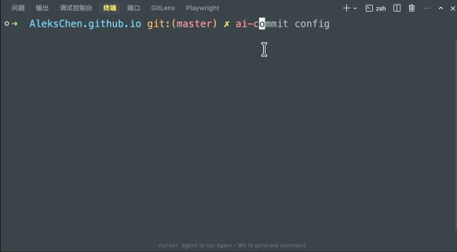

# AI Commit

**[English](README.md) | [简体中文](README_zh.md) | [日本語](README_ja.md) | [한국어](README_ko.md) | [Español](README_es.md) | [العربية](README_ar.md)**

一个强大的 CLI 工具，使用 OpenAI 兼容 API 根据你的 git 变更生成 **Conventional Commits** 提交信息。不再为提交信息发愁。让 AI 为你编写简洁、标准且有意义的提交信息。**🔒 绝对安全 | 🛡️ 隐私优先 | 🆓 100% 免费开源** 


## 特性

- 🔒 **隐私优先**：你的代码仅直接发送至你配置的 API 提供商。没有中间服务器，不进行追踪。**代码完全开源**，欢迎审计。数据仅在本地存储，绝对安全无后门。
- 🤖 **AI 驱动生成**：分析你的 `git diff` 生成准确且描述性的提交信息。
- 📏 **Conventional Commits**：开箱即用地遵循标准格式（feat, fix, chore 等）。
- 🎯 **多样化选项**：生成多个提交信息版本供你选择。
- 🌍 **多语言支持**：完全本地化的 **英语**、**中文**、**日语**、**韩语**、**西班牙语** 和 **阿拉伯语** 支持。
- 🔧 **高度可配置**：支持自定义 OpenAI 兼容 API（DeepSeek, Azure 等）、自定义模型和 Prompt。
- 📊 **成本追踪**：内置使用统计，追踪你的 Token 消耗和成本。
- 🚀 **交互模式**：直接从 CLI 审查、编辑、重新生成或提交。
- 🧠 **智能上下文**：自动压缩大型 diff 以适应 Token 限制，同时保留上下文。
- 🎨 **趣味字符画**：可自定义的启动 Banner（Psyduck, Totoro, Cat 等）。
- 🪝 **Git Hook 支持**：可作为 `prepare-commit-msg` 钩子或与其他 Git 工具配合使用。

## 安装

确保你已安装 Node.js (>= 18.0.0)。

```bash
# 通过 npm 全局安装
npm install -g @alekschen/ai-commit
```

## 更新

此工具会自动检查更新，并在有新版本时通知你。手动更新：

```bash
npm install -g @alekschen/ai-commit@latest
```

## 快速开始

1.  **初始化配置**
    运行配置命令设置你的 API Key（OpenAI 或兼容提供商）。

    ```bash
    ai-commit config
    ```

    

2.  **生成提交**
    暂存你的更改并运行：

    ```bash
    git add .
    ai-commit
    ```

    或者直接运行 `ai-commit`，让它为你自动暂存更改。

    

3.  **审查与提交**
    工具将生成一条信息。你可以：
    - **选择**：选择你偏好的信息。
    - **编辑**：在你的默认编辑器中修改信息。
    - **重新生成**：让 AI 再试一次。

## 用法

### 基本命令

```bash
# 为暂存的更改生成提交信息
ai-commit

# 提供提示词以指导生成
ai-commit "重构认证逻辑"

# 打印信息到 stdout 而不进入交互菜单（适用于脚本）
ai-commit --print

# 将信息写入文件（适用于 git hooks 如 prepare-commit-msg）
ai-commit --write .git/COMMIT_EDITMSG

# 运行静默模式（隐藏 Banner/日志）
ai-commit --quiet
```

### 配置

通过交互式菜单管理你的设置：

```bash
ai-commit config
```

你可以配置：

- **API 提供商**：Base URL（默认：`https://api.openai.com/v1`）和 API Key。
- **模型**：选择任意聊天模型（默认：`gpt-3.5-turbo`）。
- **Prompt 风格**：选择默认、Emoji、简洁或自定义模板。
- **ASCII Art**：自定义启动 Banner。
- **语言**：切换 UI 语言（支持英语、中文、日语、韩语、西班牙语、阿拉伯语）。

### 查看使用统计

检查你的 API 使用情况、Token 计数和模型性能：

```bash
ai-commit cost
```

## 环境变量

你可以使用环境变量覆盖配置，这对于 CI/CD 流水线非常有用：

| 变量 | 描述 |
| --- | --- |
| `AI_COMMIT_API_KEY` | 你的 API Key |
| `AI_COMMIT_BASE_URL` | 自定义 API Base URL |
| `AI_COMMIT_MODEL` | 模型名称（如 `gpt-4`, `deepseek-chat`） |
| `AI_COMMIT_MAX_CHARS` | diff 上下文的最大字符数（默认：200000） |
| `AI_COMMIT_MAX_FILES` | 最大处理文件数（默认：50） |
| `AI_COMMIT_MAX_LINES` | 每个文件包含的最大行数（默认：15） |
| `AI_COMMIT_INCLUDE_SNIPPETS` | 设置为 `0` 以在 Prompt 中禁用代码片段 |
| `AI_COMMIT_AUTO_STAGE` | 设置为 `1` 自动暂存更改，`0` 如果为空则失败 |
| `AI_COMMIT_SIGN` | 设置为 `1` 以签名提交 (`git commit -S`) |
| `AI_COMMIT_AMEND` | 设置为 `1` 以修正提交 (`git commit --amend`) |

## 贡献

欢迎贡献！请阅读 [CONTRIBUTING.md](CONTRIBUTING.md) 了解我们的行为准则以及提交 Pull Request 的流程。

1.  Fork 本仓库
2.  创建你的特性分支 (`git checkout -b feature/amazing-feature`)
3.  提交你的更改 (`git commit -m 'feat: add some amazing feature'`)
4.  推送到分支 (`git push origin feature/amazing-feature`)
5.  开启一个 Pull Request

## 许可证

本项目采用 MIT 许可证 - 详情请参阅 [LICENSE](LICENSE) 文件。
